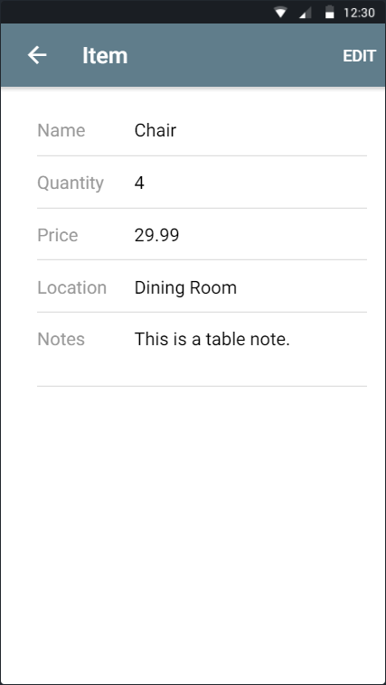

## Table of Contents
* [Getting Started](#getting-started)
  * [Create an Account](#create-an-account)
  * [Logging In](#logging-in)
  * [Main Screen](#main-screen)
* [The Basics](#the-basics)
  * [Adding an Item](#adding-an-item)
  * [Editing an Item](#editing-an-item)
  * [Deleting an Item](#deleting-an-item)
  * [Logging Out](#logging-out)
* [Advanced Operations](#advanced-operations)
  * [Searching for an Item](#searching-for-an-item)
  * [Sorting Items](#sorting-items)

# Getting Started

## Create an Account

To get started, you must create an account.

On the login screen, click 'Create an Account.'  This will bring you to the account creation screen.

When on the account creation screen, type your name, email, and password into the corresponding text boxes.  Once all accurate information is filled in, click the 'Sign Up' button.

## Logging In

On the login screen, type your email and password into the corresponding text boxes.  Once the information is filled in, click the 'Log In' button.  If the provided information is correct, this will bring you to the main screen.  If the provided information is incorrect, you will receive an error message.

## Main Screen

* Clicking the hamburger menu icon ( ☰ ) will open the side menu.
* Clicking the more options icon ( ⋮ ) will open additional options.
* Clicking the magnifying glass icon ( 🔍 ) will open the searchbar.
* Clicking the add icon ( + ) will open the item creation screen.
* Clicking an item will open the item details screen.

# The Basics

## Adding an Item

Click the add icon ( + ) in the bottom right hand corner of the main screen.

Fill out the item details.  When finished, click the 'Create' button.

## Editing an Item

Click on an item on the main screen.

Click 'Edit' in the top right hand corner of the item details screen.

Edit the item details.  When finished, click the 'Save' button.

## Deleting an Item

Click on an item on the main screen.

Click 'Edit' in the top right hand corner of the item details screen.

Click the 'Delete' button at the bottom of the item edit screen.

When prompted, click 'Yes' to confirm deletion of the item.

## Logging Out

Click the hamburger menu icon ( ☰ ) and then select the 'Logout' button at the bottom of the menu.

# Advanced Operations

## Searching for an Item

Click the magnifying glass icon ( 🔍 ) in the top right hand corner of the main screen.  The action bar will then become a searchbox in which to type what you want to search for.

Type what you want to search for and click 'Search.'

The results of your search are displayed.  Click 'Cancel' when you are finished.

## Sorting Items

Click the more options icon ( ⋮ ) in the top right hand corner of the main screen.

Then, click 'Sort by...'.

Finally, select which option to sort by and click 'OK.'

 
 

*As of 04/03/2018.  The user interface is subject to change and the manual will be updated accordingly.*