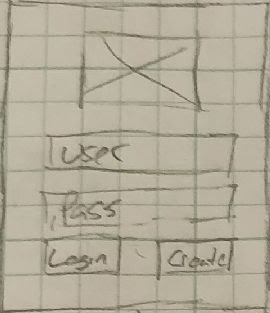
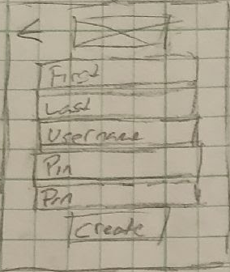
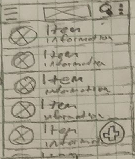
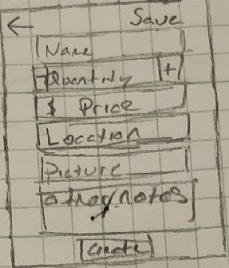
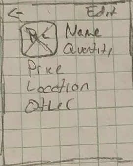
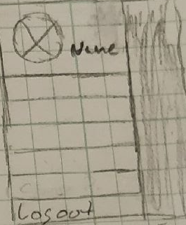

# Getting Started
### Create an Account

To get started, you must create an account.

On the Login Screen, click the Create Button.  This will bring you to the Create Account Screen.

When on the Create Account Screen, type your First Name, Last Name, Username, and Pin into the corresponding text boxes.  Once all accurate information is filled in, click the Create Button.

### Logging In

On the Login Screen, type your Username and Pin into the corresponding text boxes.  Once the information is filled in, click the Login Button.  If the provided information is correct, this will bring you to the Main Screen.  If the provided information is incorrect, you will be notified and the inputs will be cleared.

### Main Screen

Clicking the Hamburger Menu icon will open the Side Menu.
Clicking the More Options icon will open Additional Options.
Clicking the Magnifying Glass will open the Search Bar.
Clicking the Add icon will open the Create Item Screen.
Clicking an item will open the Item Details Screen.

# The Basics
### Adding an Item

Click the Add icon in the bottom right hand corner of the Main Screen.

Fill out the item details.  When finished, click the Save Button.

### Editing an Item

Click on an item on the Main Screen.

Click 'Edit' in the top right hand corner of the Item Details Screen.

Edit the item details.  When finished, click the Save Button.

### Deleting an Item

Click on an item on the Main Screen.

Click 'Edit' in the top right hand corner of the Item Details Screen.

Click 'Delete' in the top right hand corner of the Item Edit Screen.

### Logging Out

Click the Hamburger Menu icon and then select 'Logout' at the bottom of the menu.

# Advanced Operations
### Searching for an Item

Click the Magnifying Glass icon in the top right hand corner of the Main Screen.  The action bar will then become a search box in which to type what you want to search for.

### Sorting Items

Click the More Options icon in the top right hand corner of the Main Screen.  Then, click 'Sort by...' and select which option to sort by.
